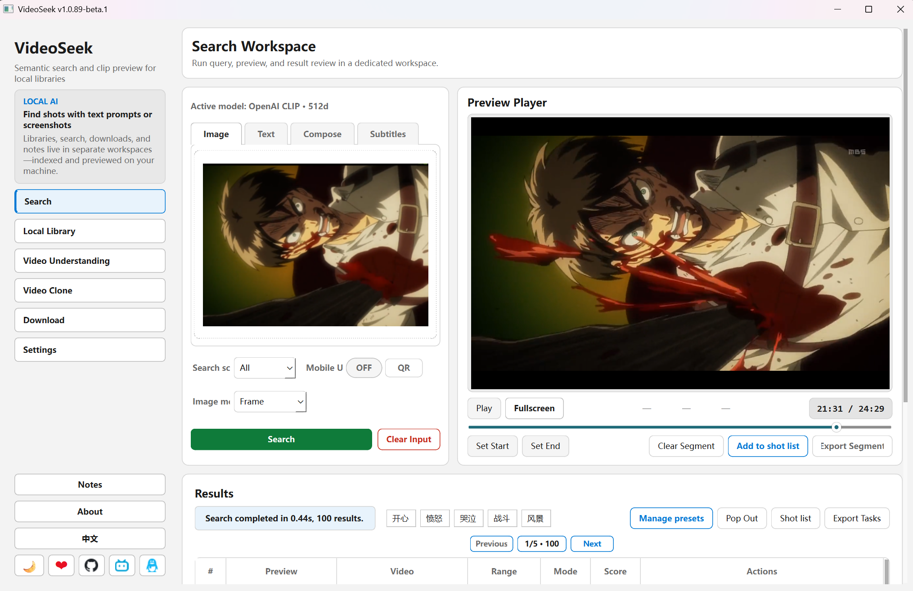

# VideoSeek

**中文** | [English](./README.en.md)

**本地视频素材库：用文字或截图找片段时间，预览后导出片段。**  
数据在本地索引与检索（ONNX + Lance + FFmpeg），不上传你的视频文件。

> 个人开源小工具，Windows 为主；安装包用户与源码用户共用同一套 UI。  
> **永久免费。** 勿信收费倒卖或付费代装；请从 [GitHub](https://github.com/6v17/VideoSeek) / [官网](https://www.lv17.top/) 获取。

## 功能一览

### 核心（做完「同步视频库」即可用）

| 功能 | 说明 |
|------|------|
| **本地视频库** | 添加文件夹为库，同步后抽帧并向量化 |
| **文字搜索** | 输入描述，在已索引视频里找相似画面时间段 |
| **图片 / 截图搜索** | 用参考图或裁剪截图找类似镜头（含定位、精搜等选项） |
| **硬字幕搜索** | 对库内视频提取画面字幕（OCR）后，按关键词检索台词时间点；支持精确匹配与模糊匹配（单字落点命中率排序，结果高亮） |
| **搜索范围** | 全库、指定库、指定视频；支持搜索预设（保存整包条件） |
| **frame / chunk** | 按帧命中或按语义 chunk 聚合结果 |
| **预览与导出** | 命中时间轴预览，导出 mp4 片段 |

### 可选扩展

| 功能 | 说明 |
|------|------|
| **视频理解** | 桌面端可选：对已同步视频按语义 chunk 生成画面描述与整片总结（OpenAI 兼容描述服务；**不**经 Agent API 暴露） |
| **本机 Agent API** | `127.0.0.1` HTTP：语义/字幕搜索、列库与视频、导出片段（见 `docs/for-agents.md`；不含视频理解） |
| **视频下载** | 从网页链接解析并下载到本地文件夹，再按普通视频库同步索引 |
| **可选插件** | 启动前可通过 `VIDEOSEEK_PLUGINS` 或 `profile/plugins.json` 加载扩展页（导航 / 模型包类型 / 文案），开源本体不含第三方插件代码 |

## 适合谁

- 硬盘 / NAS 里堆了大量素材，想**按画面语义找片段**，而不是逐个文件翻
- 剪辑前做**粗定位**，再进 NLE 精剪
- 希望**本地跑模型**，并可选让 Cursor / 其它 Agent 通过 HTTP 调搜索

## 界面预览



## 下载

不想自己配 Python / 依赖？去 **[lv17.top](https://www.lv17.top/)** 下载安装包。首次启动按应用内提示下载并 **导入运行资源**（模型、FFmpeg 等）。

## 最小使用步骤

1. **配置运行资源** — 首次启动按提示操作，或在 **设置** 中下载并 **导入** 模型、FFmpeg 等。
2. **添加视频库** — 侧边栏 **视频库** → **视频库** Tab → 添加本地文件夹。
3. **同步选中视频** — 勾选要处理的视频 → **同步选中视频**，等待抽帧与向量化完成。
4. **搜索** — 侧边栏 **搜索** → 文字或图片检索。

视频理解、硬字幕提取、Agent API 等为可选功能，**需先完成视频库同步**（字幕搜索还需导入 OCR，并在「字幕库」Tab 中提取字幕）。

图文步骤见 **[使用教程（飞书）](https://ycnwd8tcjgtu.feishu.cn/docx/ZWkrdSqA6oJTOrxQ2XscxYtmnad)**。

## 交流

- **使用教程**：[飞书文档](https://ycnwd8tcjgtu.feishu.cn/docx/ZWkrdSqA6oJTOrxQ2XscxYtmnad)（导入资源、建库同步、文搜/图搜/字幕）
- **QQ 群**：1033551438（安装、使用问题与反馈）
- **GitHub Issues**：也欢迎在此提问（尤其源码 / Agent API）

## 源码运行

推荐 **Windows 10/11**。Linux / macOS 需自行调整 ONNX 运行时（见 `docs/quickstart.md`）。

```bash
pip install -r requirements.txt
python main.py
```

也可用 Conda：`conda env create -f environment.yml` → `conda activate VideoSeek`。

首次启动会提示缺运行资源（安装包与源码用户均需在应用内导入）：

| 缺什么 | 怎么办 |
|--------|--------|
| 模型、FFmpeg | 按应用内提示下载，或 [123 云盘 zip](https://1858268090.share.123pan.cn/123pan/VFA7vd-vhJXA) → **导入并解析**；也可从 [GitHub Releases — models](https://github.com/6v17/VideoSeek/releases/tag/models) 下载各模型 zip 与 `ffmpeg.exe` 后导入 |
| VLC（仅 Windows 源码） | 从 [GitHub Releases — vlc_lib](https://github.com/6v17/VideoSeek/releases/tag/vlc_lib) 下载 `vlc_lib.zip`，解压到项目根目录 |

排障、手动摆模型、测试命令见 **`docs/quickstart.md`**。

## 文档

| 文档 | 内容 |
|------|------|
| [使用教程（飞书）](https://ycnwd8tcjgtu.feishu.cn/docx/ZWkrdSqA6oJTOrxQ2XscxYtmnad) | 安装包用户图文上手（资源导入、视频库、字幕库、搜索） |
| `docs/quickstart.md` | 源码安装细节、排障、测试 |
| `docs/for-agents.md` | 本机 Agent API 字段与示例 |
| `docs/architecture.md` | 模块与数据流（开发者向） |

## 许可证

Copyright (c) 2026 [6v17](https://github.com/6v17)

采用 [AGPL-3.0](LICENSE)（GNU Affero General Public License v3.0）。

## 感谢捐赠

真心感谢每一位打赏支持 VideoSeek 的朋友😊，你们的鼓励是我继续把工具做好的动力🤗。名单按时间记录，**不公开金额**。

想换成自己的头像，发邮件到 **2627538472@qq.com**，附上昵称和头像图就行💖💖💖。

| 头像 | 昵称 | 留言 | 日期 |
|:---:|:---|:---|:---:|
|  | 热心用户 | 很好用！感谢！😋 | 2026-07-13 |
|  | 岁岁平安 | 软件很牛逼，你也很牛逼 | 2026-07-17 |
|  | 榨一杯橙汁 | 默默支持！ | 2026-07-29 |
|  | 😊 | 默默支持！ | 2026-07-29 |
