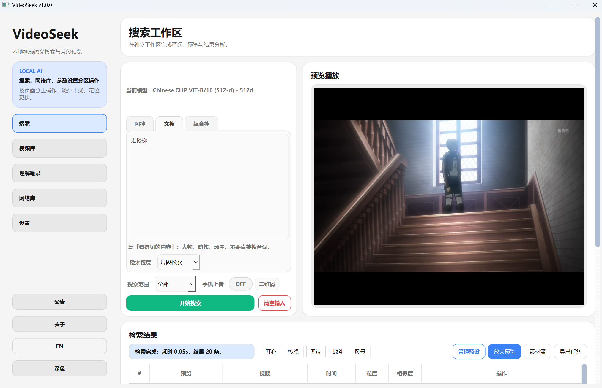
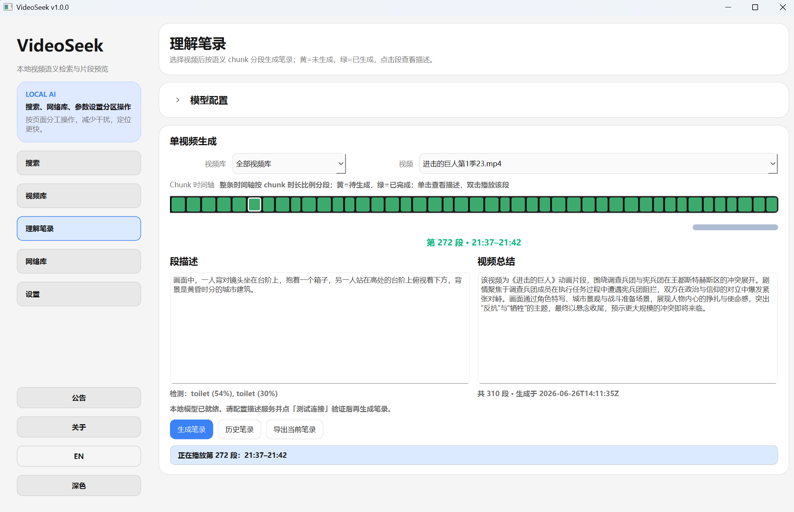

# VideoSeek

**中文** | [English](./README.en.md)

**本地视频素材库：用文字或截图找片段时间，预览后导出片段。**  
数据在本地索引与检索（ONNX + FAISS + FFmpeg），不上传你的视频文件。

> 个人开源小工具，Windows 为主；安装包用户与源码用户共用同一套 UI。

## 功能一览

### 核心（做完「同步视频库」即可用）

| 功能 | 说明 |
|------|------|
| **本地视频库** | 添加文件夹为库，同步后抽帧并向量化 |
| **文字搜索** | 输入描述，在已索引视频里找相似画面时间段 |
| **图片 / 截图搜索** | 用参考图或裁剪截图找类似镜头（含定位、精搜等选项） |
| **搜索范围** | 全库、指定库、指定视频；支持搜索预设（保存整包条件） |
| **frame / chunk** | 按帧命中或按语义 chunk 聚合结果 |
| **预览与导出** | 命中时间轴预览，导出 mp4 片段 |

### 可选扩展

| 功能 | 说明 |
|------|------|
| **理解笔录** | 对已同步视频生成 chunk 级检测 + 画面描述 + 整片总结（需 YOLO 与描述服务） |
| **本机 Agent API** | `127.0.0.1` HTTP 接口：搜索、读库列表、导出、读/生成理解笔录（见 `docs/for-agents.md`） |
| **网络库** | 从链接导入远程库并检索（与本地库流程类似） |

## 适合谁

- 硬盘 / NAS 里堆了大量素材，想**按画面语义找片段**，而不是逐个文件翻
- 剪辑前做**粗定位**，再进 NLE 精剪
- 希望**本地跑模型**，并可选让 Cursor / 其它 Agent 通过 HTTP 调搜索

## 界面预览





## 下载

不想自己配 Python / 依赖？去 **[lv17.top](https://www.lv17.top/)** 下载安装包。首次启动按应用内提示下载并 **导入运行资源**（模型、FFmpeg 等）。

## 最小使用步骤

1. **配置运行资源** — 首次启动按提示操作，或在 **设置** 中下载并 **导入** 模型、FFmpeg 等。
2. **添加视频库** — 侧边栏 **视频库** → 添加本地文件夹。
3. **同步视频库** — 选中库后点 **同步**，等待抽帧与向量化完成。
4. **搜索** — 侧边栏 **搜索** → 文字或图片检索。

理解笔录、Agent API 等为可选功能，**需先完成视频库同步**。

## 交流

- **QQ 群**：1033551438（安装、使用问题与反馈）
- **GitHub Issues**：也欢迎在此提问（尤其源码 / Agent API）

## 源码运行

推荐 **Windows 10/11**。Linux / macOS 需自行调整 ONNX 运行时（见 `docs/quickstart.md`）。

```bash
pip install -r requirements.txt
python main.py
```

也可用 Conda：`conda env create -f environment.yml` → `conda activate VideoSeek`。

首次启动会提示缺运行资源（安装包与源码用户均需在应用内导入）：

| 缺什么 | 怎么办 |
|--------|--------|
| 模型、FFmpeg | 按应用内提示下载，或 [123 云盘 zip](https://1858268090.share.123pan.cn/123pan/VFA7vd-vhJXA) → **导入并解析** |
| VLC（仅 Windows 源码） | [vlc_lib.zip](https://github.com/6v17/VideoSeek/releases/download/vlc_lib/vlc_lib.zip) 解压到项目根目录 |

排障、手动摆模型、测试命令见 **`docs/quickstart.md`**。

## 文档

| 文档 | 内容 |
|------|------|
| `docs/quickstart.md` | 安装细节、排障、测试 |
| `docs/for-agents.md` | 本机 Agent API 字段与示例 |
| `docs/architecture.md` | 模块与数据流（开发者向） |

## 许可证

MIT
