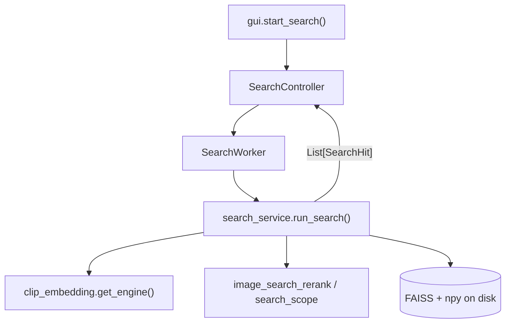
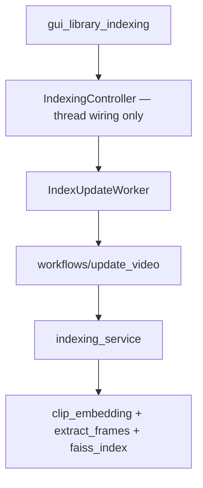
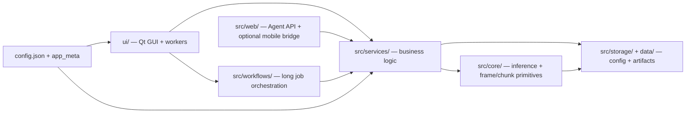
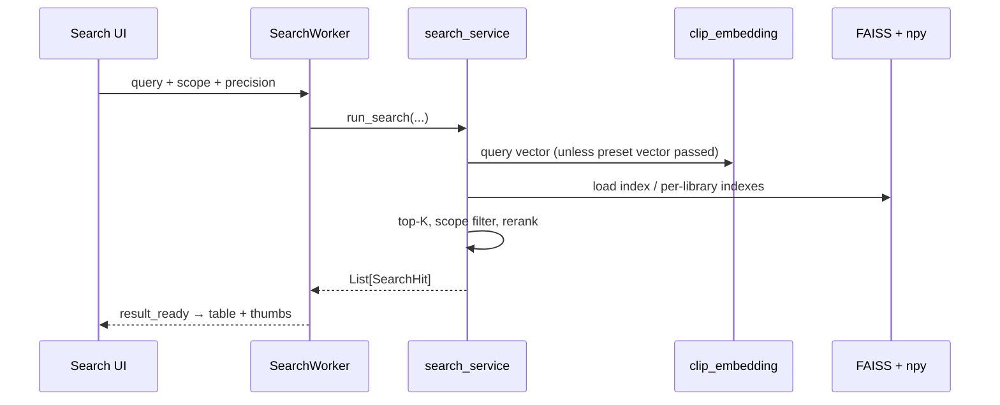

# VideoSeek Architecture

This document describes **how the code actually runs**, not an idealized “enterprise layer cake.”  
If a diagram shows seven boxes but the hot path only touches three modules, the diagram is wrong — see [Reality check](#reality-check) below.

## Public entry points (use these)

| Task | Import / call |
|------|----------------|
| Local search | `from src.services.search_service import run_search, run_chunk_search` |
| Search scope (desktop + Agent default) | `from src.services.search_scope import resolve_default_active_search_scope, resolve_effective_search_scope` |
| Preset / inline query (Agent + preset chip) | `from src.services.search_request_service import resolve_search_query_inputs` |
| Image precision (Agent / shared) | `from src.services.search_request_service import normalize_search_precision_mode` |
| Index rebuild orchestration | `from src.workflows.update_video import update_videos_flow` |
| Embedding / ONNX | `from src.core.clip_embedding import get_engine` |
| Agent HTTP | `src/web/agent_api.py` → `execute_agent_search` (calls `search_service` directly) |

**Removed:** `src/core/core.py` was a 4-line re-export shim (`run_search` → `search_service`). Do not add it back.

## Reality check

Gemini-style critiques often assume: *UI → Service → Core → Storage × 7* for every change.

**Actual local search (desktop):**



**Actual Agent search (no UI hop):**


**Actual indexing:**



### Layer verdict (where complexity really lives)

| Module | Role | Verdict |
|--------|------|---------|
| `search_service.py` | FAISS load, scope, neighbor/pixel rerank, chunk/frame branches | **Main search brain** |
| `indexing_service.py` | Frame extract, embed, chunk, write indexes | **Main index brain** |
| `clip_embedding.py` | ONNX sessions, batch encode, engine singleton | **Inference core** |
| `search_request_service.py` | Precision mode + inline image validation + preset/inline query resolution | Shared GUI + Agent |
| `search_scope.py` | Active scope, filters, `resolve_effective_search_scope` | Shared GUI + Agent |
| `agent_api.py` | HTTP, preset/scope resolution, timeouts | Own subsystem; ends at `search_service` |
| `IndexingController` / `AgentApiController` / `MobileBridgeController` | Start/stop background services | Thin — OK |
| `src/domain/search_hit.py` | `SearchHit` dataclass | Boundary type only |
| `inference_registry.py` | 3 provider factories (~25 lines) | Small plug-in table |

This is **not** “FAISS + cosine only”: frame/chunk modes, per-library indexes, scoped over-fetch, neighbor rerank, precise image pixel rerank, presets, and Agent batching all live in **services**, with **core** doing inference and low-level index I/O.

## System overview



## Local search sequence



Inside `run_search`, major branches:

1. **Chunk mode** → `run_chunk_search`.
2. **Scoped video list** → per-video frame search.
3. **Scoped libraries + v2 per-library index ready** → query each library index, merge.
4. **Else** → global index, optional over-fetch + `apply_search_scope`, neighbor/pixel rerank.

See also `docs/ai/pipelines.md` for the same flow in Chinese.

## Domain models (`src/domain/`)

- **`SearchHit`**: one local match (`start_sec`, `end_sec`, `score`, `video_path`). Built in `search_service`; returned to UI and Agent.
- **`RemoteSearchHit`**: remote vector search row; built in `remote_search_service`.

**Legacy:** `coerce_search_hit()` still accepts old 4-tuples at the **view boundary** (`table_views`, `ThumbLoader`). New code should pass `SearchHit` only; do not emit tuples from services.

## Inference engines (`src/core/inference_registry.py`)

- Providers register with `register_inference_engine(provider_id, factory)`.
- `clip_embedding.get_engine()` resolves the active profile’s `provider` via `build_inference_engine`.
- Built-in: **`clip_onnx`**, **`siglip2_onnx`**, **`chinese_clip_onnx`**.
- Unknown `provider` **fail fast** (no silent fallback to another model — wrong fallback would corrupt search results).
- Disk layout: `resolve_provider_dir()` in `config_store`; vectors under `data/model_assets/<provider_dir>/<variant>/`.

### Adding a model provider

1. Implement `*OnnxEngine` (often `OnnxVisionBatchMixin`).
2. `register_inference_engine("<provider>_onnx", factory)` in `clip_embedding._register_default_inference_engines`.
3. Map folder in `resolve_provider_dir()`.
4. Manifest defaults in `model_package_service` / `model_service`.
5. Users must **rebuild the library index** after switching profile.

## Configuration

- **User:** `config.json` (theme, fps, search knobs, agent timeouts, …).
- **Product:** `src/app/app_meta.py` (version URLs, manifest endpoints).
- **Reads:** prefer `src/storage/config_store.py` getters (`get_search_mode`, `get_search_top_k`, rerank getters, …).

## Auxiliary HTTP (`src/web/`)

| Module | Purpose | Weight in architecture |
|--------|---------|-------------------------|
| `agent_api.py` | Localhost Agent API (health, search, batch, presets) | **Primary** automation surface |
| `mobile_bridge.py` | Phone upload companion | Optional; thin controller wrapper |
| `display_qr.py` | QR for mobile pairing | Optional UI helper |

## Main flows (short)

### Indexing

1. UI → `IndexingController` → `IndexUpdateWorker`.
2. `workflows/update_video.update_videos_flow` orchestrates scan, embed, global/per-library indexes.
3. `indexing_service` calls `clip_embedding`, `extract_frames`, `faiss_index`.

### Remote library

Presenters/controllers on Remote Library page → `remote_library_service` staged pipeline; search via `remote_search_service`.

## Repository layout (logical)

```text
main.py
src/
  app/           config, i18n, logging
  domain/        SearchHit, RemoteSearchHit
  services/      search_service, indexing_service, search_scope, search_request_service, …
  core/          clip_embedding, extract_frames, faiss_index, inference_registry, …
  storage/       config_store, asset_store, migration_runner
  web/           agent_api, mobile_bridge, display_qr
  workflows/     update_video (index job orchestration)
ui/
  windows/       gui + feature mixins
  controllers/   thread lifecycle (search, indexing, agent, mobile, …)
  workers.py     QThread wrappers → services / workflows
docs/
  architecture.md    (this file)
  for-agents.md      Agent HTTP contract
  ai/pipelines.md    pipeline notes (ZH)
```

## Changelog

| Date | Change |
|------|--------|
| 2026-05-31 | Consolidate Agent scope/query parsing into `search_scope` + `search_request_service`; slim `agent_api` wrappers |
