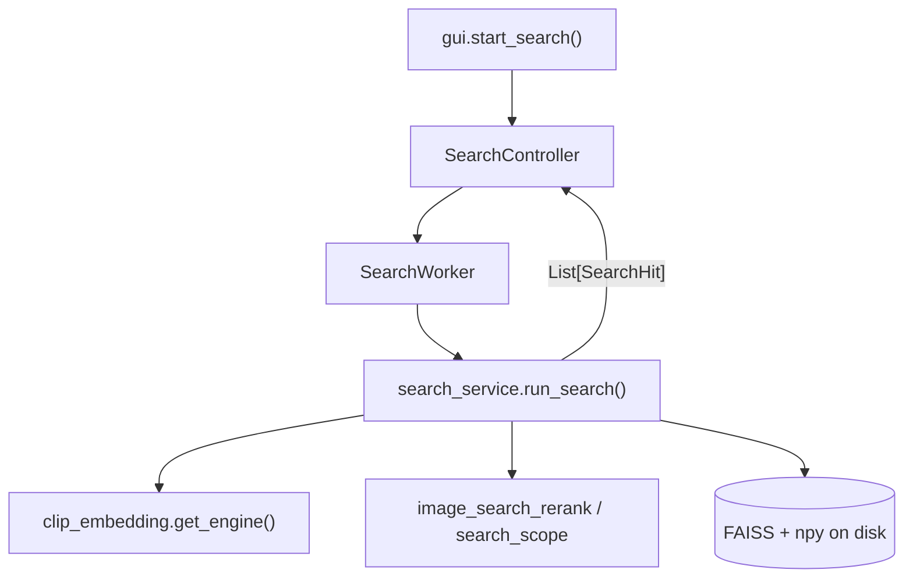
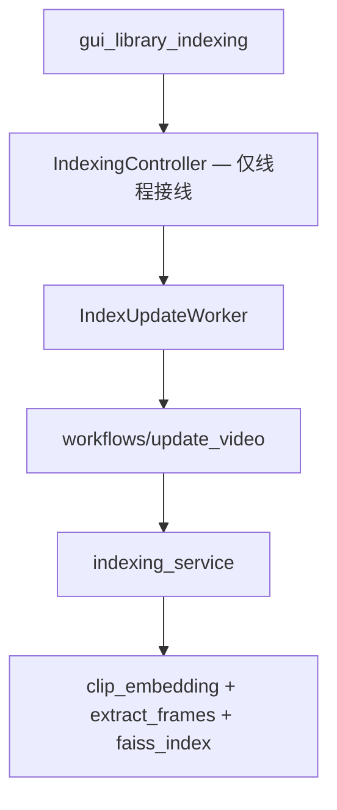
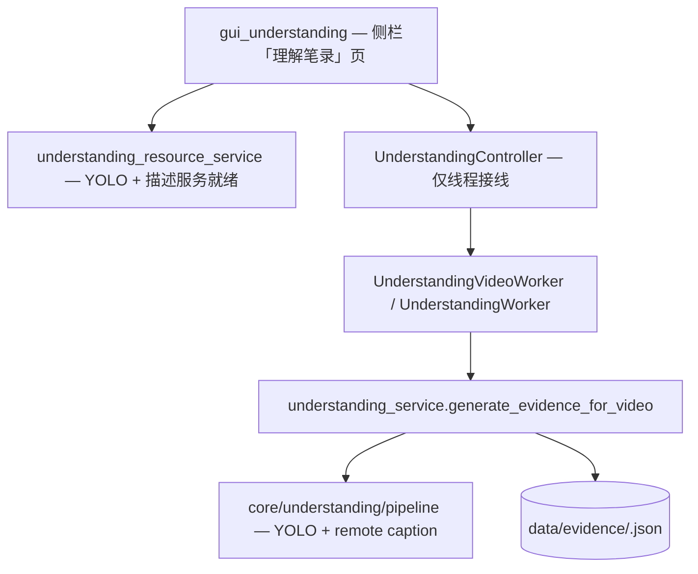
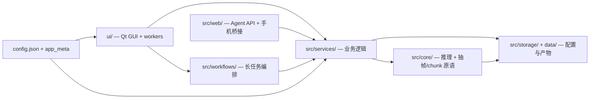
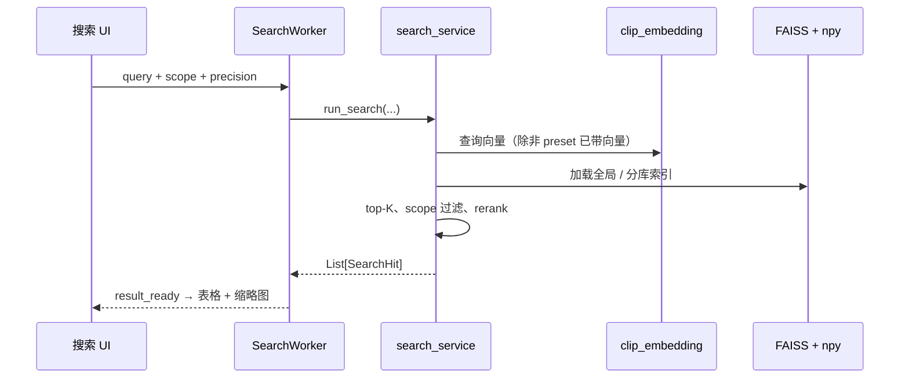

# VideoSeek 架构

桌面语义视频检索（PySide6 + ONNX + FAISS + FFmpeg）。主流程：

```text
建索引 → 语义检索 → 定位 / 预览 → 导出片段 →（可选）理解笔录 →（可选）本机 Agent API
```

主要模块：

| 模块 | 职责 |
|------|------|
| `search_service.py` | frame/chunk 搜索、scope、rerank、预设 |
| `indexing_service.py` | 索引构建与复用、全局/分库合并 |
| `clip_embedding.py` | ONNX 推理（`clip_onnx` / `siglip2_onnx` / `chinese_clip_onnx`；换模型须重建索引） |
| `understanding_service.py` | 理解笔录生成、读盘/写盘、`EvidenceBundle` 编排 |
| `understanding_resource_service.py` | YOLO / profile 扫描、描述服务探测、`understanding_ready` |

**理解笔录**为可选扩展，不阻塞搜索与索引；契约与分阶段说明见 [`docs/ai/understanding_evidence.md`](ai/understanding_evidence.md)。桌面 UI 说明见 [`docs/pyside6_ui_architecture.md`](pyside6_ui_architecture.md)。

`ui/` 与 `src/web/agent_api.py` 负责调度；搜索逻辑在 `search_service`，FastAPI 层不复制。Agent HTTP 契约见 `docs/for-agents.md`。已移除功能见 `docs/planned_features.md` §4。

下文按实际调用关系说明。热路径与分层图不一致时，以 [热路径](#热路径) 为准。

## 入口（改功能从这里找）

| 任务 | 导入 / 调用 |
|------|----------------|
| 本地搜索 | `from src.services.search_service import run_search, run_chunk_search` |
| 搜索范围（桌面 + Agent 默认） | `from src.services.search_scope import resolve_default_active_search_scope, resolve_effective_search_scope` |
| 预设 / 内联 query（Agent + 预设 chip） | `from src.services.search_request_service import resolve_search_query_inputs` |
| 图搜精度（Agent / 共用） | `from src.services.search_request_service import normalize_search_precision_mode` |
| 索引重建编排 | `from src.workflows.update_video import update_videos_flow` |
| Embedding / ONNX | `from src.core.clip_embedding import get_engine` |
| 理解笔录生成 | `from src.services.understanding_service import generate_evidence_for_video` |
| 理解资源就绪 | `from src.services.understanding_resource_service import get_understanding_resource_status` |
| Agent HTTP | `src/web/agent_api.py` → `execute_agent_search`（直接调 `search_service`） |

## 热路径

复杂逻辑集中在少数模块，不必按目录层级逐层改。

**桌面本地搜索：**



**Agent 搜索（不经 UI）：**


**建索引：**



**理解笔录（可选，桌面手动触发）：**



进入理解页时，YOLO 等本地检查同步完成；**描述服务连通性**在 `UnderstandingResourceStatusWorker` 后台探测（不阻塞切页）。生成仍走 `understanding_service`，与搜索/索引解耦。

### 各层实际权重

| 模块 | 作用 | 说明 |
|------|------|------|
| `search_service.py` | FAISS 加载、scope、neighbor/pixel rerank、chunk/frame 分支 | **搜索主逻辑** |
| `indexing_service.py` | 抽帧、embedding、chunk、写索引 | **索引主逻辑** |
| `clip_embedding.py` | ONNX session、批量编码、引擎单例 | **推理核心** |
| `search_request_service.py` | 精度模式、内联图校验、预设/query 解析 | GUI + Agent 共用 |
| `search_scope.py` | 当前范围、过滤、`resolve_effective_search_scope` | GUI + Agent 共用 |
| `agent_api.py` | HTTP、预设/scope、超时 | 独立子系统；止于 `search_service` |
| `understanding_service.py` | 单视频/批量生成、bundle 读写、历史列表 | **理解笔录主逻辑** |
| `understanding_resource_service.py` | manifest 扫描、profile、remote VLM 探测 | **理解资源层** |
| `core/understanding/` | YOLO ONNX、remote caption、pipeline | **理解推理** |
| `IndexingController` / `AgentApiController` / `MobileBridgeController` / `UnderstandingController` | 启停后台服务 | 薄层 |
| `src/domain/search_hit.py` | `SearchHit` dataclass | 边界类型 |
| `src/domain/evidence_bundle.py` | `EvidenceBundle` schema | 理解笔录边界类型 |
| `inference_registry.py` | 3 个 provider 工厂（约 25 行） | 小插件表 |

Frame/chunk、分库索引、scope over-fetch、rerank、预设与 Agent 批处理在 **services**；**core** 负责推理与索引 I/O。

## 系统总览



## 本地搜索时序



`run_search` 内主要分支：

1. **Chunk 模式** → `run_chunk_search`
2. **限定视频列表** → 按视频 frame 搜
3. **限定库 + v2 分库索引就绪** → 逐库查询后合并
4. **其它** → 全局索引，必要时 over-fetch + `apply_search_scope`，再 rerank

逐步细节见 `docs/ai/pipelines.md` Pipeline 4。

## 领域模型（`src/domain/`）

- **`SearchHit`**：一条本地命中（`start_sec`、`end_sec`、`score`、`video_path`）。在 `search_service` 构造；返回给 UI 与 Agent。
- **`RemoteSearchHit`**：远程库命中行；在 `remote_search_service` 构造。
- **`EvidenceBundle`**：单视频理解笔录（chunk 级 YOLO/caption + 可选整片 summary）。在 `understanding_service` 读写；schema 见 `evidence_bundle.py`。

**遗留：** `coerce_search_hit()` 仍在**视图边界**（`table_views`、`ThumbLoader`）接受旧 4-tuple。新代码只传 `SearchHit`；services 不要 emit tuple。

## 推理引擎（`src/core/inference_registry.py`）

- Provider 通过 `register_inference_engine(provider_id, factory)` 注册。
- `clip_embedding.get_engine()` 按当前 profile 的 `provider` 经 `build_inference_engine` 解析。
- 内置：**`clip_onnx`**、**`siglip2_onnx`**、**`chinese_clip_onnx`**。
- 未知 `provider` **直接失败**（不静默换模型，否则会污染检索结果）。
- 磁盘布局：`config_store.resolve_provider_dir()`；向量在 `data/model_assets/<provider_dir>/<variant>/`。

### 新增模型 provider

1. 实现 `*OnnxEngine`（常用 `OnnxVisionBatchMixin`）。
2. 在 `clip_embedding._register_default_inference_engines` 里 `register_inference_engine("<provider>_onnx", factory)`。
3. 在 `resolve_provider_dir()` 映射目录名。
4. 在 `model_package_service` / `model_service` 补 manifest 默认值。
5. 用户切换 profile 后须 **重建媒体库索引**。

## 配置

- **用户：** `config.json`（主题、fps、搜索参数、Agent 超时、`understanding.remote_vlm` 等）。
- **产品：** `src/app/app_meta.py`（版本 URL、manifest 端点）。
- **读取：** 优先用 `src/storage/config_store.py` 的 getter（`get_search_mode`、`get_search_top_k`、rerank 相关等）。

## 辅助 HTTP（`src/web/`）

| 模块 | 用途 | 权重 |
|------|------|------|
| `agent_api.py` | 本机 Agent API（health、search、batch、presets） | **主要**自动化入口 |
| `mobile_bridge.py` | 手机传图 | 可选；薄封装 |
| `display_qr.py` | 手机配对二维码 | 可选 UI 辅助 |

## 主流程（简）

### 建索引

1. UI → `IndexingController` → `IndexUpdateWorker`
2. `workflows/update_video.update_videos_flow` 编排扫描、embedding、全局/分库索引
3. `indexing_service` 调用 `clip_embedding`、`extract_frames`、`faiss_index`

### 远程库

远程链接页 presenter/controller → `remote_library_service` 分阶段构建；检索走 `remote_search_service`。

### 理解笔录（可选）

1. 侧栏 **理解笔录** → `UnderstandingGuiMixin`（`gui_understanding.py`）
2. 就绪检查 → `understanding_resource_service.get_understanding_resource_status`（本地 YOLO 同步；描述服务后台 probe）
3. 用户点「生成笔录」→ `UnderstandingController` → `UnderstandingVideoWorker` → `understanding_service.generate_evidence_for_video`
4. 推理 → `core/understanding/pipeline`（本地 YOLO + OpenAI 兼容描述服务 caption/summary）
5. 落盘 → `data/evidence/videos/<video_id>.json`（路径由 `understanding_paths` 解析）

不影响 `run_search` / 索引主链路。Agent Phase 5（`GET /videos/evidence`）规划见 `understanding_evidence.md` §8。

## 目录结构（逻辑）

```text
main.py
src/
  app/           配置、i18n、日志
  domain/        SearchHit, RemoteSearchHit, EvidenceBundle
  services/      search_service, indexing_service, understanding_*, search_scope, …
  core/          clip_embedding, extract_frames, faiss_index, understanding/, …
  storage/       config_store, asset_store, migration_runner
  web/           agent_api, mobile_bridge, display_qr
  workflows/     update_video
ui/
  windows/       gui + mixin（含 gui_understanding）
  controllers/   搜索、索引、理解、Agent、手机等线程生命周期
  workers.py     QThread → services / workflows（含 UnderstandingResourceStatusWorker）
docs/
  architecture.md
  pyside6_ui_architecture.md
  for-agents.md
  ai/pipelines.md
  ai/understanding_evidence.md
```

## 变更记录

| 日期 | 变更 |
|------|------|
| 2026-06-26 | 补充理解笔录模块：入口表、热路径、领域模型、`understanding_*` 服务与文档索引 |
| 2026-06-12 | 全文改为中文；精简文首概览 |
| 2026-06-10 | 增加文首中文概览 |
| 2026-05-31 | Agent scope/query 收敛到 `search_scope` + `search_request_service` |
